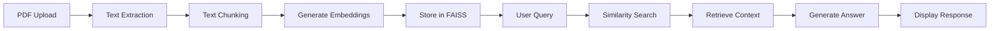

# Chat with PDF using Gemini AI 💁

[](https://www.python.org/downloads/)
[](https://streamlit.io/)
[](https://gemini.google.com/)
[](https://langchain.com/)
[](https://opensource.org/licenses/MIT)

> A powerful Streamlit-based web application that enables intelligent conversations with your PDF documents using Google's Gemini AI and RAG (Retrieval Augmented Generation) technology.

## 🚀 Overview

This application allows users to upload multiple PDF documents and engage in natural language conversations about their content. Powered by Google's advanced Gemini Pro model and sophisticated vector search capabilities, it provides accurate, context-aware responses based on the actual content of your documents.

## ✨ Features

- 📄 **Multi-PDF Support**: Upload and process multiple PDF files simultaneously
- 🤖 **AI-Powered Q&A**: Natural language questioning with intelligent responses
- 🔍 **Semantic Search**: Advanced FAISS vector store for efficient document retrieval
- 🎯 **Context-Aware**: Responses grounded in your actual document content
- 💬 **Interactive UI**: Clean, intuitive Streamlit interface
- ⚡ **Fast Processing**: Optimized text chunking and embedding generation
- 🔒 **Secure**: Local processing with your own Google API key

## 🛠️ Tech Stack

| Component | Technology |
|-----------|------------|
| **Frontend** |  |
| **LLM** |  |
| **Embeddings** | Google Generative AI Embeddings |
| **Vector Store** |  |
| **PDF Processing** |  |
| **Framework** |  |

## 📋 Prerequisites

Before you begin, ensure you have:

-  or higher
- A Google API Key for Gemini AI ([Get one here](https://makersuite.google.com/app/apikey))
- Basic knowledge of Python and command line

## ⚡ Quick Start

### 1. Clone the Repository

```bash
git clone https://github.com/ChrissLee191/rag-multimodal.git
cd rag-multimodal
```

### 2. Create Virtual Environment (Recommended)

```bash
# Windows
python -m venv venv
venv\Scripts\activate

# macOS/Linux
python3 -m venv venv
source venv/bin/activate
```

### 3. Install Dependencies

```bash
pip install -r requirements.txt
```

### 4. Environment Setup

Create a `.env` file in the project root:

```env
GOOGLE_API_KEY=your_google_api_key_here
```

> 💡 **Tip**: Keep your API key secure and never commit it to version control!

### 5. Run the Application

```bash
streamlit run main.py
```

The application will open in your default browser at `http://localhost:8501`

## 📖 Usage

### Step-by-Step Guide

1. **🚀 Launch the Application**
   ```bash
   streamlit run main.py
   ```

2. **📁 Upload Your PDFs**
   - Navigate to the sidebar
   - Click "Browse files" to select your PDF documents
   - Select multiple files if needed
   - Click "Submit & Process"

3. **⏳ Processing**
   - Wait for the "Processing..." spinner to complete
   - Your documents are being converted to searchable vectors

4. **💬 Start Chatting**
   - Type your question in the main input field
   - Press Enter or click outside the field
   - Get instant AI-powered answers!

### Example Questions

- *"What are the main conclusions of this research paper?"*
- *"Summarize the financial results from Q3"*
- *"What methodology was used in this study?"*
- *"List all the recommendations mentioned in the document"*

## 🔧 How It Works



### Technical Pipeline

1. **📄 PDF Processing**: Extract text content using PyPDF2
2. **✂️ Text Chunking**: Split documents into manageable segments (10K chars, 1K overlap)
3. **🧠 Embedding Generation**: Convert text to vectors using Google's embedding model
4. **💾 Vector Storage**: Store embeddings in FAISS for fast similarity search
5. **🔍 Query Processing**: 
   - Convert user questions to embeddings
   - Find most relevant document chunks
   - Provide context to Gemini Pro
   - Generate comprehensive answers

## ⚙️ Configuration

### Model Parameters

| Parameter | Value | Description |
|-----------|-------|-------------|
| **Chunk Size** | `10,000` | Maximum characters per text segment |
| **Chunk Overlap** | `1,000` | Overlapping characters between chunks |
| **LLM Model** | `gemini-pro` | Google's flagship language model |
| **Temperature** | `0.3` | Controls response creativity (0=focused, 1=creative) |
| **Embedding Model** | `models/embedding-001` | Google's text embedding model |

### Custom Configuration

To modify settings, edit the parameters in `main.py`:

```python
# Text chunking
text_splitter = RecursiveCharacterTextSplitter(
    chunk_size=10000,      # Adjust based on your needs
    chunk_overlap=1000     # Reduce for less redundancy
)

# Model temperature
model = ChatGoogleGenerativeAI(
    model="gemini-pro",
    temperature=0.3        # 0.0-1.0, lower = more focused
)
```

## 📁 Project Structure

```
rag-multimodal/
├── 📄 main.py          # Main application
├── 📄 requirements.txt     # Python dependencies
├── 📄 README.md           # Documentation
├── 📄 .env                # Environment variables (create this)
├── 📄 .gitignore          # Git ignore file
└── 📁 faiss_index/        # Vector database (auto-generated)
    ├── index.faiss
    └── index.pkl
```

## 🐛 Troubleshooting

<details>
<summary><strong>🔑 API Key Issues</strong></summary>

- ✅ Verify your Google API key is correctly set in `.env`
- ✅ Ensure the API key has Gemini model access
- ✅ Check for extra spaces or quotes in the key
- ✅ Try regenerating the API key if issues persist

</details>

<details>
<summary><strong>📦 Installation Problems</strong></summary>

```bash
# Update pip first
pip install --upgrade pip

# Install with verbose output
pip install -r requirements.txt -v

# Try with --no-cache-dir if needed
pip install -r requirements.txt --no-cache-dir
```

</details>

<details>
<summary><strong>📄 PDF Processing Issues</strong></summary>

- ❌ **Password-protected PDFs**: Not supported
- ❌ **Image-only PDFs**: Require OCR preprocessing
- ✅ **Large PDFs**: May take longer to process
- ✅ **Scanned documents**: Extract text first using OCR tools

</details>

<details>
<summary><strong>💾 Memory & Performance</strong></summary>

For large documents:
- Reduce chunk size: `chunk_size=5000`
- Decrease overlap: `chunk_overlap=500`
- Process smaller batches of PDFs
- Ensure sufficient RAM (4GB+ recommended)

</details>

### 🚀 Performance Optimization

| Issue | Solution |
|-------|----------|
| Slow processing | Reduce PDF size or chunk size |
| High memory usage | Process fewer documents at once |
| Poor answer quality | Increase chunk overlap |
| Irrelevant responses | Use more specific questions |

## 🤝 Contributing

We welcome contributions! Here's how you can help:

### Development Setup

1. **Fork the repository**
2. **Create a feature branch**
   ```bash
   git checkout -b feature/amazing-feature
   ```
3. **Make your changes**
4. **Add tests** (if applicable)
5. **Commit your changes**
   ```bash
   git commit -m "Add amazing feature"
   ```
6. **Push to your branch**
   ```bash
   git push origin feature/amazing-feature
   ```
7. **Open a Pull Request**

### Contribution Guidelines

- Follow PEP 8 style guidelines
- Add docstrings to new functions
- Update README if adding new features
- Test your changes locally

### Areas for Contribution

- 🔧 **Features**: Multi-language support, OCR integration
- 🐛 **Bug fixes**: Report issues with detailed reproduction steps
- 📖 **Documentation**: Improve tutorials and examples
- 🎨 **UI/UX**: Enhance the Streamlit interface
- ⚡ **Performance**: Optimize processing speed

## 📄 License

This project is licensed under the MIT License - see the [LICENSE](LICENSE) file for details.

```
MIT License

Copyright (c) 2025 RAG Multimodal

Permission is hereby granted, free of charge, to any person obtaining a copy
of this software and associated documentation files (the "Software"), to deal
in the Software without restriction, including without limitation the rights
to use, copy, modify, merge, publish, distribute, sublicense, and/or sell
copies of the Software, and to permit persons to whom the Software is
furnished to do so, subject to the following conditions:

The above copyright notice and this permission notice shall be included in all
copies or substantial portions of the Software.
```

## 🙏 Acknowledgments

Special thanks to the amazing open-source community:

- **[Streamlit Team](https://streamlit.io/)** - For the incredible web framework
- **[LangChain](https://langchain.com/)** - For the powerful AI development tools
- **[Google AI](https://ai.google/)** - For Gemini Pro and embedding models
- **[Meta Research](https://github.com/facebookresearch/faiss)** - For FAISS vector search
- **[Python Community](https://www.python.org/)** - For the amazing ecosystem
